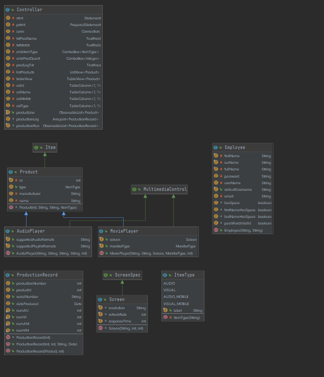
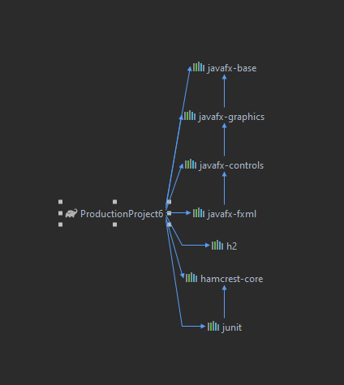

# ProductionProject6
This project is a production log tracker that stores user entered products into a database 
and displays it to a product table, and a list view. A user can select the product from 
the list view as well as the quantity they want to produce. This adds the entry into another
database and displays the info of each product produced and the exact date and time it was produced.

This was an individual project that I worked on throughout my junior year at Florida Gulf Coast 
University which served as my object-oriented programming class's final.

# Demonstration

# Documentation
[JavaDoc]()

# Diagrams

My database in intellij is having some errors 
and can't view the database, or the database diagrams

# Getting Started
Download src files to local machine

Create new project using gradle

Open code in IDE and run

# Built With
Intellij IDEA Ultimate 

# Author
Christopher Dervan

# Acknowledgements
[Professor's Website](https://sites.google.com/site/profvanselow/portfolio?authuser=0)

Jeremy Martin TA

# History
6th revision due to complicated unknown errors

# Key Programming Concepts Utilized
Object-Oriented Programming

Working with GUI and JavaFX

Encapsulation

Databases

Overloading Methods and Constructors

Interfaces and Enums

Prepared Statements

Inheritance

Polymorphism

Exception Handling

Arrays and Collections

Regular Expressions

Recursion

